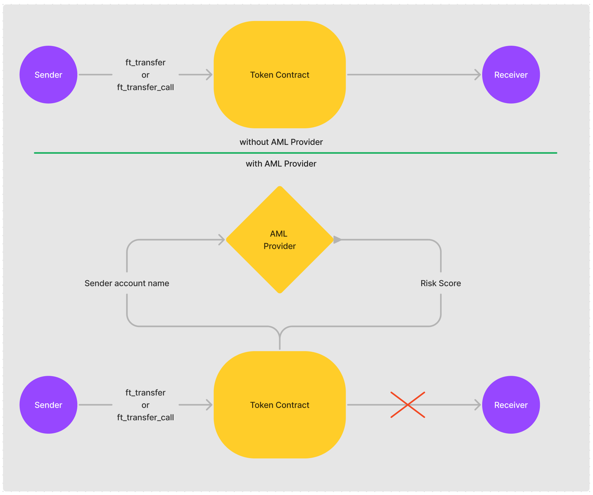
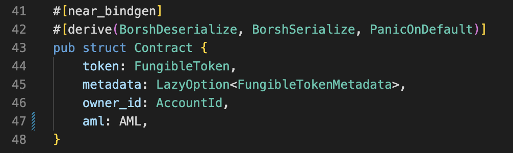

# Hapi integration example

We have a couple of examples of integrating HAPI protocol in a smart contract.

But firstly let's understand how it works, and what it changes.

You can use HAPI for any calls on your contract.

For example, using it in the standard fungible token.



After the call to the contract, the contract makes a call to AML, receives a response from it, and depending on the result, completes its function.

In the example with a token: an account with a high level of risk will not be able to send tokens.

Another example: is an exchange platform that does not accept exchange tokens from a high-risk account.

In your smart contract You can set the level for all categories, and individual for each one separately.

## What is categories and risk score? 

Hapi protocol supports 18 categories

| Category | Description |
|----------|-------|
| None | |
| WalletService | Wallet service - custodial or mixed wallets |
| MerchantService | Merchant service |
| MiningPool | Mining pool |
| LowRiskExchange | Low-risk exchange - Exchange with high KYC standards |
| MediumRiskExchange | Medium risk exchange |
| DeFi | DeFi application |
| OTCBroker | OTC Broker |
| ATM | Cryptocurrency ATM |
| Gambling | Gambling |
| IllicitOrganization | Illicit organization |
| Mixer | Mixer |
| DarknetService | Darknet market or service |
| Scam | Scam |
| Ransomware | Ransomware |
| Theft | Theft - stolen funds |
| Counterfeit | Counterfeit - fake assets |
| TerroristFinancing | Terrorist financing |
| ChildAbuse | Child abuse and porn materials |


If the address belongs to some category, it will have a
Risk score (on a scale from 0..10, i.e. max risk).

Address of the [contract](https://github.com/HAPIprotocol/near-proxy-contract) on the **testnet**

```
hapi-test.testnet
```
Address of the contract on the **mainnet**

```
proxy.hapiprotocol.near
```

## What to do for using hapi? 

1. Add hapi to dependencies of your project in Cargo.toml
```
[dependencies]
...
hapi-near-connector = "0.1"
```

2. Add use hapi in your lib.rs file
```
use hapi_near_connector::aml::*;
```

3. Add AML struct to your Contract struct


4. Add "AML new" to init of your contract

>Note. Here we set the accepted risk level as MAX_RISK_LEVEL/2 i.e 10/2 = 5. 
```
aml: AML::new(aml_account_id, MAX_RISK_LEVEL/2)
```

5. Add cross-contract call to the method on which we need to use hapi. 
* *ext_aml* - it's hapi's trait. 
* In get_address pass accountId you want to check. 
* *ext_self* - is the trait that will be created in the next step. 
* cb_ft_tranfer - is the method for callback after aml.
```rust
fn ft_transfer(
        &mut self,
        receiver_id: AccountId,
        amount: U128,
        memo: Option<String>,
) -> Promise {
    assert_one_yocto();
    let sender: AccountId = predecessor_account_id();
    ext_aml::ext(self.aml.get_account())
        .with_static_gas(AML_CHECK_GAS)
        .get_address(sender.clone())
        .then(
            ext_self::ext(current_account_id())
                .with_static_gas(CALLBACK_AML_GAS)
                .cb_ft_transfer(sender, receiver_id, amount, memo),
        )
}
```

6. Create a trait with a callback
```rust
#[ext_contract(ext_self)]
pub trait ExtContract {
    /// Callback after ft_transfer.
    fn cb_ft_transfer(
        &mut self,
        sender_id: AccountId,
        #[callback] category_risk: CategoryRisk,
        receiver_id: AccountId,
        amount: U128,
        memo: Option<String>,
    );
}
```

After that, your contract can already work with Hapi.

If you need to change the accepted risk level for *All* categories or add a new one, use *update_category*.


```rust
fn update_category(&mut self, category: Category, risk_score: RiskScore) {
    self.assert_owner();
    self.aml.update_category(category, risk_score);
}
```

Also, you can delete an added category. Then it will be evaluated in the *All* category.
>Note. You can't delete the category *All*.

```rust
fn remove_category(&mut self, category: Category) {
    self.assert_owner();
    self.aml.remove_category(category);
}
```

## Integration HAPI in already deployed contract
------------------

For the integration of HAPI in an already deployed contract, you should do the previous steps, and add a method that migrates your old contract struct to a new struct that includes HAPI.

```rust
pub trait Migrations {
    fn add_hapi(aml_account_id: AccountId) -> Self;
}

#[near_bindgen]
impl Migrations for Contract {
    #[private]
    #[init(ignore_state)]
    #[allow(dead_code)]
    fn add_hapi(aml_account_id: AccountId) -> Self {
        #[derive(BorshDeserialize)]
        pub struct OldContract {
            token: FungibleToken,
            metadata: LazyOption<FungibleTokenMetadata>,
            owner_id: AccountId,
        }

        let old_contract: OldContract = env::state_read().expect("Old state doesn't exist");

        Self {
            token: old_contract.token,
            metadata: old_contract.metadata,
            owner_id: old_contract.owner_id,
            aml: AML::new(aml_account_id, MAX_RISK_LEVEL / 2),
        }
    }
}
```

Then you need to rebuild and redeploy the new wasm. Migrate your contract with the command
```bash
near call $CONTRACT_ID add_hapi '{"aml_account_id": "'$AML_ID'"}' --accountId $CONTRACT_ID
```

Now your contract is ready to work with HAPI. And you can remove the *Migrations* trait from your contract.